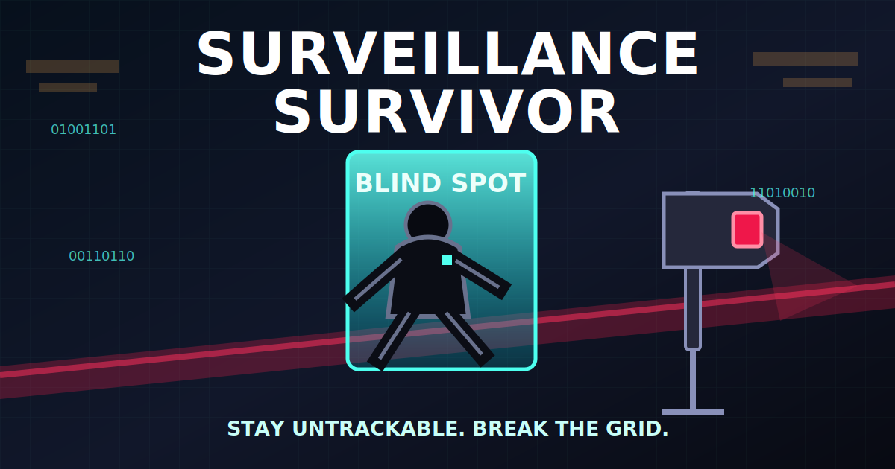

<div align="center">



# Surveillance Survivor

**An iPhone-first satirical survivor roguelite about staying untrackable long enough to break an absurd privatized surveillance grid.**

[](https://github.com/scrimshawlife-ctrl/Surveillance-Survivor/actions/workflows/ci.yml)


[Vision](#vision) · [Gameplay](#gameplay-pillars) · [Architecture](#architecture) · [Build](#local-development) · [Roadmap](#roadmap) · [Docs](#documentation)

</div>

> **Development status:** active pre-alpha. The deterministic core, native iPhone shell, touch controls, entity projection, Suspicion HUD, and production asset contracts are being established before content expansion.

## Vision

**Surveillance Survivor** turns suburban surveillance infrastructure, privatized authority, automated suspicion, and bureaucratic theater into a fast, readable, replayable action roguelite.

You enter a procedurally assembled district, evade escalating observation systems, destroy or confuse LPR camera poles, assemble an anti-surveillance build, defeat the district authority, and escape through a temporary **Blind Spot**.

The tonal target is **paranoid slapstick**, not horror realism: tactical golf carts, overconfident guards, fluorescent parking lots, contradictory radio chatter, procurement absurdity, and systems that mistake visibility for guilt.

## Gameplay pillars

| Pillar | Player-facing result |
|---|---|
| **Stay untrackable** | Break line of sight, redirect attention, spoof identity, and exploit environmental cover. |
| **Weaponize suspicion** | Ride higher Suspicion tiers for greater danger, denser rewards, and stronger escalation. |
| **Break the grid** | Destroy, hack, rotate, spoof, or bureaucratically confuse surveillance infrastructure. |
| **Build strange synergies** | Combine signal disruption, social camouflage, physical disruption, and procedural warfare. |
| **Extract through a Blind Spot** | Defeat the district authority and escape before the surveillance system reasserts control. |

## Canonical MVP

```yaml
platform: iPhone
orientation: landscape
minimum_os: iOS 18
language: Swift 6
renderer: SpriteKit
application_shell: SwiftUI
simulation: deterministic_fixed_step
networking: none
accounts: none
analytics: local_receipts_only
business_model: premium_single_purchase
```

The first vertical slice must prove:

- responsive virtual-stick movement;
- deterministic simulation independent of render frame rate;
- readable enemy pressure and automatic attacks;
- Suspicion tiers `0...5`;
- destructible LPR camera poles;
- deterministic three-choice upgrades;
- the **Shift Manager** boss;
- **Blind Spot** extraction;
- interruption-safe pause and resume;
- reproducible build, test, and gameplay receipts.

## Architecture

The simulation is authoritative. SpriteKit projects state; it does not own game truth.

```text
Player Input
    ↓
Fixed-Step Simulation (1/60)
    ↓
Authoritative RunState
    ├── entities
    ├── suspicion
    ├── progression
    ├── boss state
    └── extraction state
    ↓
SpriteKit Projection + SwiftUI HUD
```

### Technology stack

| Layer | Technology | Responsibility |
|---|---|---|
| App shell | SwiftUI | lifecycle, menus, overlays, accessibility |
| Gameplay rendering | SpriteKit | world projection, particles, animation, camera |
| Gameplay core | Swift Package | deterministic state transitions and contracts |
| Audio | AVAudioEngine | adaptive buses and interruption-safe playback |
| Haptics | Core Haptics | tier, damage, upgrade, and extraction feedback |
| Persistence | SwiftData / bounded local receipts | settings, unlocks, run summaries |
| Project generation | XcodeGen | reproducible Xcode project generation |
| CI | GitHub Actions | core tests, project generation, simulator build |

## Repository layout

```text
App/                         SwiftUI application shell and HUD
Game/                        SpriteKit scenes, input, and rendering adapters
Sources/SurveillanceCore/    Deterministic gameplay authority
Tests/                       Core and app-facing tests
Platform/                    Audio, haptics, persistence, accessibility
Resources/                   Runtime asset catalogs and data
Docs/                        Canonical engineering and execution references
.github/workflows/           Continuous integration
project.yml                  XcodeGen project authority
Package.swift                Swift package authority
Makefile                     Local build and validation commands
```

## Local development

### Requirements

- macOS with Xcode 26 or newer;
- Swift 6 toolchain;
- [XcodeGen](https://github.com/yonaskolb/XcodeGen);
- an iPhone or iOS Simulator for app validation.

### Bootstrap

```bash
git clone https://github.com/scrimshawlife-ctrl/Surveillance-Survivor.git
cd Surveillance-Survivor
git switch agent/iphone-bootstrap
brew install xcodegen
make generate
open SurveillanceSurvivor.xcodeproj
```

### Validation

```bash
# Deterministic Swift package tests
make test

# Generate the Xcode project and build the simulator target
make build

# Run the complete local gate
make validate
```

A successful package test is necessary but not sufficient. Changes affecting rendering, input, lifecycle, audio, haptics, performance, or accessibility require simulator and physical-device evidence.

## Current implementation status

| Surface | State |
|---|---|
| Deterministic fixed-step core | Implemented |
| Seeded randomness | Implemented |
| Authoritative run state | Implemented |
| Suspicion tiers | Implemented |
| SwiftUI shell | Implemented |
| SpriteKit projection | Implemented baseline |
| Virtual-stick input | Implemented baseline |
| Pause/resume lifecycle | Implemented baseline |
| Native Suspicion meter | Implemented baseline |
| Production texture ingestion | In progress |
| Combat, upgrades, boss, extraction | Planned vertical-slice work |
| Physical-iPhone acceptance run | Pending |

## Roadmap

### WP1 — Playable foundation

- world bounds and camera follow;
- collision broad phase and contact resolution;
- node and projectile pooling;
- left-handed control mode;
- simulator and physical-device validation.

### WP2 — Combat and surveillance systems

- automatic attack targeting;
- LPR scan behavior and destruction states;
- enemy pressure and damage;
- Suspicion-driven escalation;
- audio and haptic event routing.

### WP3 — Vertical slice

- Big-Box Parking Expanse district;
- The Ghost player character;
- deterministic upgrade selection;
- the Shift Manager boss;
- Blind Spot extraction;
- persisted run summary and evidence receipt.

See the open [issues](https://github.com/scrimshawlife-ctrl/Surveillance-Survivor/issues) and [draft bootstrap PR](https://github.com/scrimshawlife-ctrl/Surveillance-Survivor/pull/1) for active engineering scope.

## Visual asset policy

Reference boards and marketing compositions are preserved separately from runtime exports. Runtime textures are accepted only when they satisfy the production contract:

- deterministic names;
- verified dimensions and sRGB encoding;
- real alpha transparency where required;
- common canvases and documented anchors;
- no labels, grids, captions, or presentation borders;
- nearest-neighbor readability on physical iPhone hardware;
- collision geometry defined by simulation data, never by image bounds.

Shape-node fallbacks remain authoritative until each binary asset passes validation.

## Documentation

| Reference | Purpose |
|---|---|
| [`docs/ONE_SHOT_EXECUTION.md`](docs/ONE_SHOT_EXECUTION.md) | bounded implementation sequence and acceptance gates |
| [`docs/VISUAL_ASSETS_V0_1.md`](docs/VISUAL_ASSETS_V0_1.md) | original visual-pack audit and art-direction authority |
| [`docs/VISUAL_ASSETS_V0_2_INTAKE.md`](docs/VISUAL_ASSETS_V0_2_INTAKE.md) | production texture intake and naming contract |
| [`Game/Rendering/GameAssetName.swift`](Game/Rendering/GameAssetName.swift) | canonical runtime asset namespace |
| [Notion concept packet](https://app.notion.com/p/3a43e8ba2f5c81a099bfc757aa9dcea4) | product vision and satire boundaries |
| [iOS architecture](https://app.notion.com/p/3a53e8ba2f5c8146b8ecd700e6d56b9c) | system boundaries and dependency direction |
| [Verification plan](https://app.notion.com/p/3a53e8ba2f5c813a942eeb17058f9ffd) | CI, simulator, and device evidence requirements |

## Scope boundaries

The MVP is intentionally offline and self-contained. It does **not** use real surveillance feeds, live location data, external accounts, advertising, multiplayer, user-generated content, or a backend service.

The game is satirical fiction. Its target is surveillance theater, automated suspicion, privatized authority, and institutional absurdity—not claims about real-world coordinated stalking.

## Contributing

Development currently follows issue-bounded work packages and draft pull requests. Before changing gameplay authority, asset contracts, lifecycle behavior, or scope boundaries:

1. read the relevant canonical document;
2. identify the owning module;
3. preserve deterministic state ownership;
4. add or update validation coverage;
5. record any physical-device requirement that CI cannot prove.

## License

No public license has been declared yet. All rights are reserved unless and until a license file is added to the repository.

---

<div align="center">

**Stay Untrackable. Break the Grid.**

</div>
