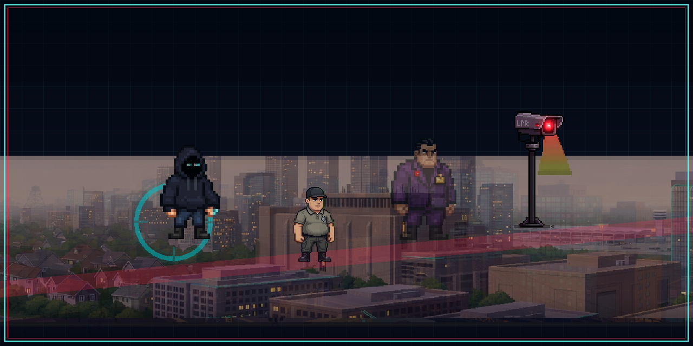
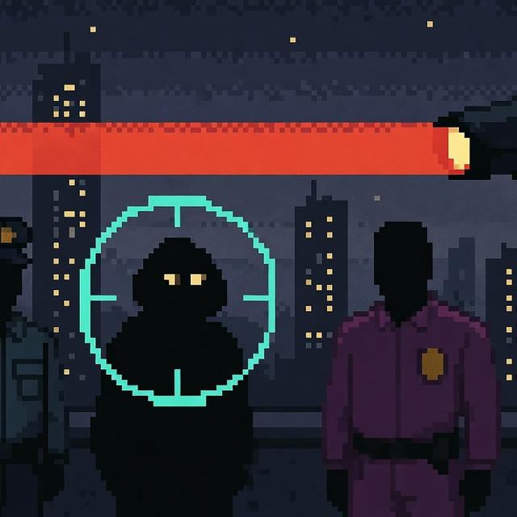

<div align="center">



# Surveillance Survivor

**Stay untrackable. Break the grid.**

An iPhone-first satirical survivor roguelite about dodging privatized cameras, weaponizing suspicion, and extracting through temporary Blind Spots across a ten-city American campaign.

<br />

<!-- Badges: each links to a live source of truth -->
[](https://github.com/scrimshawlife-ctrl/Surveillance-Survivor/actions/workflows/ci.yml?query=branch%3Amain)
[](docs/REPO_STATUS.md)
[](#canonical-mvp)
[](#canonical-mvp)
[](Package.swift)
[](#architecture)
[](#architecture)
[](#scope-boundaries)
[](docs/TEN_CITY_CAMPAIGN_ROSTER.md)
[](docs/cities/)
[](docs/ENVIRONMENT_ART_MAP.md)
[](docs/VISUAL_ASSET_MAP.md)
[](https://github.com/scrimshawlife-ctrl/Surveillance-Survivor/issues)
[](https://github.com/scrimshawlife-ctrl/Surveillance-Survivor/pulls)
[](https://github.com/scrimshawlife-ctrl/Surveillance-Survivor/commits/main)

<br />

[Vision](#vision) ·
[Gameplay](#gameplay-pillars) ·
[Campaign](#ten-city-campaign) ·
[Art atlas](#city-environment-art-atlas) ·
[Architecture](#architecture) ·
[Build](#local-development) ·
[Status](#current-implementation-status) ·
[Roadmap](#roadmap) ·
[Docs](#documentation)

</div>

---

> **Development status:** active **pre-alpha**. Simulator-ready vertical slice with deterministic core, ten-city district profiles, campaign unlocks, visual asset map, global environment package v1, and **all ten city foundation packs** on `main` (**194 validated runtime PNGs** at the current QA baseline). Audio catalog is dry-run until approved binaries. **Not release-ready** — physical-device acceptance and App Store owner fields remain open. Live board: [`docs/REPO_STATUS.md`](docs/REPO_STATUS.md).

## Vision

**Surveillance Survivor** turns suburban camera infrastructure, privatized authority, automated suspicion, and bureaucratic theater into a fast, readable, landscape-iPhone roguelite.

You enter a procedurally assembled district, evade escalating observation systems, destroy or confuse LPR poles, assemble an anti-surveillance build, defeat the district authority, and escape through a temporary **Blind Spot**.

Tone target: **paranoid slapstick**, not horror realism — tactical golf carts, overconfident guards, fluorescent parking lots, contradictory radio chatter, and systems that mistake visibility for guilt.

## Gameplay pillars

| Pillar | Player-facing result |
| --- | --- |
| **Stay untrackable** | Break line of sight, redirect attention, spoof identity, exploit cover. |
| **Weaponize suspicion** | Higher tiers mean denser rewards and sharper escalation. |
| **Break the grid** | Destroy, hack, rotate, spoof, or bureaucratically confuse infrastructure. |
| **Build strange synergies** | Signal disruption, social camouflage, physical disruption, procedural warfare. |
| **Extract through a Blind Spot** | Defeat the authority and leave before the system reasserts control. |

## Ten-city campaign

Escalation runs from local installations to regional sharing, interagency fusion, public-private ambiguity, and the commercial surveillance platform itself.

| Level | City | District title | Boss |
| ---: | --- | --- | --- |
| 1 | Wichita | **The Panopticon of the Plains** | The Aviation Security Commissioner |
| 2 | Louisville | **Derby Day Data Dragnet** | The Keeper of Confidential Coordinates |
| 3 | Tulsa | **The Petroleum Panopticon** | The Golden Watchman |
| 4 | Dayton | **Gateway City: Every Camera Counts** | The Director of Gateway Optimization |
| 5 | Oakland | **The Sanctuary Scanner** | The Contract Renewal Hydra |
| 6 | San Francisco | **Fog of Probable Cause** | The Algorithmic Moderate |
| 7 | Columbus | **The Six-Hundred-Eye Statehouse** | The Mayor of Meaningful Review |
| 8 | New York City | **The Five-Borough Omnigaze** | The Five-Borough Data Baron |
| 9 | Los Angeles | **Thirty-Five Hundred Eyes, No One in Charge** | The Decentralized Accountability Producer |
| 10 | Atlanta | **Flock's Nest** | The Safety Evangelist |

Final trilogy: **New York City → Los Angeles → Atlanta**. Full roster, landmarks, and bosses: [`docs/TEN_CITY_CAMPAIGN_ROSTER.md`](docs/TEN_CITY_CAMPAIGN_ROSTER.md).

> The campaign is evidence-weighted and gameplay-ordered. It is **not** a definitive national ranking of real Flock deployments.

### City environment art atlas

Foundation packs ship as modular 2.5D top-down textures (13 per city). Projection rules live in the **environment atlas** and **visual asset map** (badges above).

| Level | City | Pack | Runtime prefix |
| ---: | --- | --- | --- |
| 1–10 | All ten cities | **On `main`** | `wichita_*` … `atlanta_*` |

| Atlas | What it is |
| --- | --- |
| [`docs/ENVIRONMENT_ART_MAP.md`](docs/ENVIRONMENT_ART_MAP.md) | Global biomes + city foundation projection |
| [`docs/VISUAL_ASSET_MAP.md`](docs/VISUAL_ASSET_MAP.md) | Sim role → texture → fallback registry |
| [`docs/cities/`](docs/cities/) | Per-city inventory, reuse matrix, manifest, receipt |
| [`docs/REPO_STATUS.md`](docs/REPO_STATUS.md) | PR / issue / pack board |

Hero art: approved marketing still ([`docs/readme-hero.png`](docs/readme-hero.png); source [`docs/readme-hero-source.jpg`](docs/readme-hero-source.jpg)).

## Canonical MVP

```yaml
platform: iPhone
orientation: landscape
minimum_os: iOS 18
language: Swift 6
renderer: SpriteKit
application_shell: SwiftUI
simulation: deterministic_fixed_step
networking: none
accounts: none
analytics: local_receipts_only
business_model: premium_single_purchase
```

Vertical slice must prove: virtual-stick movement · fixed-step sim · readable pressure · Suspicion `0…5` · destructible LPR poles · three-choice upgrades · Shift Manager · Blind Spot extraction · pause/resume · reproducible receipts.

## Architecture

Simulation is authoritative. SpriteKit projects state; it does not own game truth.

```text
Player Input
    ↓
Fixed-Step Simulation (1/60)
    ↓
Authoritative RunState
    ├── entities · suspicion · progression
    ├── boss state · extraction state
    ↓
SpriteKit Projection + SwiftUI HUD
```

| Layer | Technology | Responsibility |
| --- | --- | --- |
| App shell | SwiftUI | lifecycle, menus, overlays, accessibility |
| Gameplay rendering | SpriteKit | world projection, particles, animation, camera |
| Gameplay core | Swift Package | deterministic state transitions and contracts |
| Audio | AVAudioEngine | adaptive buses, interruption-safe playback |
| Haptics | Core Haptics | tier, damage, upgrade, extraction feedback |
| Persistence | SwiftData / local receipts | settings, unlocks, run summaries |
| Project generation | XcodeGen | reproducible Xcode project |
| CI | GitHub Actions | core tests + simulator |

## Repository layout

```text
App/                         SwiftUI shell and HUD
Game/                        SpriteKit scenes, input, rendering
Sources/SurveillanceCore/    Deterministic gameplay authority
Tests/                       Core and app-facing tests
Platform/                    Audio, haptics, persistence, accessibility
Resources/                   RuntimeSprites + Assets.xcassets
docs/                        Engineering + city art evidence
.github/workflows/           CI
project.yml                  XcodeGen authority
Package.swift                Swift package authority
Makefile                     Local validation commands
```

## Local development

### Requirements

- macOS with Xcode 26+
- Swift 6 toolchain
- [XcodeGen](https://github.com/yonaskolb/XcodeGen)
- iPhone or iOS Simulator

### Bootstrap

```bash
git clone https://github.com/scrimshawlife-ctrl/Surveillance-Survivor.git
cd Surveillance-Survivor
brew install xcodegen   # once
make generate
open SurveillanceSurvivor.xcodeproj
```

### Validation

```bash
make test              # deterministic package tests
make privacy-check     # PrivacyInfo.xcprivacy
make assets-check      # runtime PNG contract (194 sprites at current baseline)
make audio-check       # ElevenLabs manifest / queue gate
make build             # XcodeGen + simulator build
make simulator-test    # unit + UI tests
make simulator-smoke   # install / launch / screenshot
make simulator-visual-stress # deterministic dense-combat screenshot + receipt
make simulator-visual-matrix # dense-combat screenshots + aggregate receipt for all 10 cities
make emulator-test     # full automated emulator suite
make validate          # CI-parity local gate

DEVICE_UDID=<udid> make device-smoke   # signed physical-device smoke
```

Current non-device QA baseline: **211 package tests**, **317 simulator-hosted tests**, and **10 black-box XCUITests** covering launch chrome, pause/resume, settings, accessibility persistence, upgrade selection, extraction, defeat, daily/weekly challenge launch, and dense-combat rendering. Package tests are necessary but not sufficient for rendering, input, lifecycle, audio, haptics, or accessibility — use simulator and device evidence. See [`docs/EMULATOR_AUTOMATION.md`](docs/EMULATOR_AUTOMATION.md).

## Current implementation status

Legend: **Implemented** · **Emulator-verified** · **Partial** · **Pending**

| Surface | State |
| --- | --- |
| Deterministic fixed-step core | Implemented + package tests |
| Ten-city campaign authority | Implemented — `districts.json` |
| Campaign unlocks | Implemented — offline progression |
| Visual asset map | Implemented (`VisualAssetMap`) |
| Global environment package v1 | Attached |
| City foundation packs (1–10) | **All on `main`** — 13 textures each |
| Guard / boss / player / LPR sprites | Attached |
| Audio event catalog | Map + dry-run; **no product playback** until approved binaries |
| Emulator automation | Emulator-verified |
| Physical-iPhone acceptance | **Pending** |
| App Store owner fields | **Pending** |

### Next engineering frontiers

See [`docs/ROADMAP.md`](docs/ROADMAP.md) for full phasing. Immediate:

1. Physical-device acceptance — [#2](https://github.com/scrimshawlife-ctrl/Surveillance-Survivor/issues/2) · [`RELEASE_READINESS.md`](docs/RELEASE_READINESS.md).
2. ART device QA + ship note — [#3](https://github.com/scrimshawlife-ctrl/Surveillance-Survivor/issues/3) · [`ART_PRODUCTION_READINESS.md`](docs/ART_PRODUCTION_READINESS.md).
3. Audio — Batch 0 done; Batch 1 after license — **[`docs/AUDIO_PLAN.md`](docs/AUDIO_PLAN.md)**.
4. Store owner fields — [`APP_STORE_METADATA.md`](docs/APP_STORE_METADATA.md).

## Roadmap

Launch lane **P0–P7** and systemic design lane **P8–P11** — full authority: [`docs/ROADMAP.md`](docs/ROADMAP.md) · [`docs/ROGUELIKE_BENCHMARK_AND_DESIGN_ASSIMILATION.md`](docs/ROGUELIKE_BENCHMARK_AND_DESIGN_ASSIMILATION.md).

| Package | Outcome |
| --- | --- |
| **WP0 — Foundation** | Repo, XcodeGen, package boundaries, CI, docs |
| **WP1 — Headless runtime** | Fixed-step clock, RNG, entities, receipts |
| **WP2 — Playable scene** | SpriteKit, input, camera, auto-attack |
| **WP3 — Signature loop** | Visibility, Suspicion, LPR, upgrades, waves |
| **WP4 — Vertical slice** | Enemies, Shift Manager, Blind Spot, audio, haptics |
| **WP5–6 — Shell & hardening** | Settings, a11y, persistence, device protocol, release evidence |
| **P8–P11 — Systemic lane** | Director, city state, builds, coordination, story, proof district, city projection, replayability |

Open [issues](https://github.com/scrimshawlife-ctrl/Surveillance-Survivor/issues) and [`docs/RELEASE_READINESS.md`](docs/RELEASE_READINESS.md) list remaining gates.

## Visual asset policy

Runtime textures must satisfy:

- deterministic names · verified dimensions · sRGB · clean alpha  
- no labels / grids / captions · nearest-neighbor iPhone readability  
- collision from simulation data, never image bounds  
- landmarks establish place without text · no recolor of prior cities  

Shape fallbacks remain authoritative until each binary passes validation. Intake: [`docs/VISUAL_ASSETS_V0_2_INTAKE.md`](docs/VISUAL_ASSETS_V0_2_INTAKE.md).

## Documentation

| Reference | Purpose |
| --- | --- |
| [`docs/README.md`](docs/README.md) | **Documentation index** — authority routing |
| [`docs/ROADMAP.md`](docs/ROADMAP.md) | **Product roadmap** (P0–P11) |
| [`docs/VERSIONING.md`](docs/VERSIONING.md) | Version domains, migrations, supersession |
| [`versions.json`](versions.json) | Machine-readable version registry |
| [`docs/ROGUELIKE_BENCHMARK_AND_DESIGN_ASSIMILATION.md`](docs/ROGUELIKE_BENCHMARK_AND_DESIGN_ASSIMILATION.md) | Approved P8–P11 systemic design program |
| [`docs/RELEASE_READINESS.md`](docs/RELEASE_READINESS.md) | **Production readiness** evidence matrix |
| [`docs/ART_PRODUCTION_READINESS.md`](docs/ART_PRODUCTION_READINESS.md) | ART / issue #3 inventory + sign-off |
| [`docs/APP_STORE_METADATA.md`](docs/APP_STORE_METADATA.md) | App Store worksheet (drafts + owner gaps) |
| [`docs/REPO_STATUS.md`](docs/REPO_STATUS.md) | Live PR / issue / task board |
| [`docs/CONTINUATION_PLAN.md`](docs/CONTINUATION_PLAN.md) | Engineering continuation sequence |
| [`docs/EMULATOR_AUTOMATION.md`](docs/EMULATOR_AUTOMATION.md) | Automated simulator suite |
| [`docs/TEN_CITY_CAMPAIGN_ROSTER.md`](docs/TEN_CITY_CAMPAIGN_ROSTER.md) | Cities, bosses, landmarks |
| [`docs/ENVIRONMENT_ART_MAP.md`](docs/ENVIRONMENT_ART_MAP.md) | Environment atlas |
| [`docs/VISUAL_ASSET_MAP.md`](docs/VISUAL_ASSET_MAP.md) | Visual asset atlas |
| [`docs/cities/`](docs/cities/) | Per-city art receipts |
| [`docs/GAMEPLAY_ANIMATION_PLAN.md`](docs/GAMEPLAY_ANIMATION_PLAN.md) | **Animation plan** — physics-informed presentation |
| [`docs/AUDIO_PLAN.md`](docs/AUDIO_PLAN.md) | **Audio plan (agent entry)** — status + batch order |
| [`docs/AUDIO_AGENT_EXECUTION.md`](docs/AUDIO_AGENT_EXECUTION.md) | Audio agent workflow + batches |
| [`docs/AUDIO_ASSET_MANIFEST.json`](docs/AUDIO_ASSET_MANIFEST.json) | Machine work queue (62 assets) |
| [`docs/AUDIO_ASSET_PRODUCTION_BIBLE.md`](docs/AUDIO_ASSET_PRODUCTION_BIBLE.md) | ElevenLabs inventory authority |
| [`docs/AUDIO_EVENT_MAP.md`](docs/AUDIO_EVENT_MAP.md) | Runtime cue contract |
| [`docs/audio/`](docs/audio/) | Batch receipts (Batch 0 inventory) |
| [`Resources/Audio/`](Resources/Audio/) | Masters / delivery trees |
| [`Game/Rendering/VisualAssetMap.swift`](Game/Rendering/VisualAssetMap.swift) | Role registry |
| [`Game/Rendering/GameAssetName.swift`](Game/Rendering/GameAssetName.swift) | Asset namespace |

## Scope boundaries

The MVP is offline and self-contained. It does **not** use real surveillance feeds, live location, external accounts, ads, multiplayer, UGC, or a backend.

Satirical fiction only — targets surveillance theater and privatized authority, not claims about real-world coordinated stalking.

## Contributing

Issue-bounded work packages and draft PRs. Before changing gameplay authority, assets, lifecycle, or campaign content:

1. Read the relevant canonical doc  
2. Identify the owning module  
3. Preserve deterministic state ownership  
4. Add or update validation  
5. Record any device requirement CI cannot prove  

## License

No public license declared yet. **All rights reserved** unless a `LICENSE` file is added.

---

<div align="center">



<br />

**Stay Untrackable. Break the Grid.**

</div>
